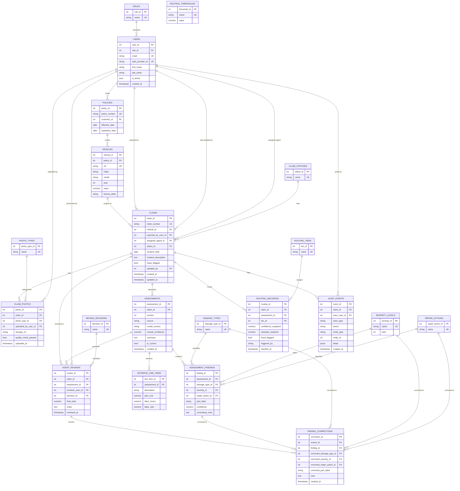

# FastTrack Entity-Relationship Diagram

```mermaid
erDiagram
    ROLES ||--o{ USERS : classifies
    USERS ||--o{ POLICIES : "holds"
    POLICIES ||--o{ VEHICLES : covers
    VEHICLES ||--o{ CLAIMS : "subject of"
    USERS ||--o{ CLAIMS : "reported by"
    USERS ||--o{ CLAIMS : "last updated by"
    USERS ||--o{ CLAIMS : "assigned agent"
    CLAIM_STATUSES ||--o{ CLAIMS : sets
    CLAIMS ||--o{ CLAIM_PHOTOS : has
    PHOTO_TYPES ||--o{ CLAIM_PHOTOS : categorizes
    USERS ||--o{ CLAIM_PHOTOS : "uploaded by"
    CLAIMS ||--o{ ASSESSMENTS : generates
    ASSESSMENTS ||--o{ ASSESSMENT_FINDINGS : contains
    DAMAGE_TYPES ||--o{ ASSESSMENT_FINDINGS : classifies
    SEVERITY_LEVELS ||--o{ ASSESSMENT_FINDINGS : rates
    REPAIR_ACTIONS ||--o{ ASSESSMENT_FINDINGS : specifies
    ASSESSMENTS ||--o{ ESTIMATE_LINE_ITEMS : itemizes
    CLAIMS ||--o{ AGENT_REVIEWS : "reviewed in"
    ASSESSMENTS ||--o{ AGENT_REVIEWS : reviewed
    USERS ||--o{ AGENT_REVIEWS : "performed by"
    AGENT_REVIEWS ||--o{ FINDING_CORRECTIONS : records
    REVIEW_DECISIONS ||--o{ AGENT_REVIEWS : classifies
    ASSESSMENT_FINDINGS ||--o{ FINDING_CORRECTIONS : "corrected in"
    DAMAGE_TYPES ||--o{ FINDING_CORRECTIONS : "corrected to"
    SEVERITY_LEVELS ||--o{ FINDING_CORRECTIONS : "corrected to"
    REPAIR_ACTIONS ||--o{ FINDING_CORRECTIONS : "corrected to"
    CLAIMS ||--o{ ROUTING_DECISIONS : routes
    ROUTING_TIERS ||--o{ ROUTING_DECISIONS : assigns
    CLAIMS ||--o{ AUDIT_EVENTS : logs
    USERS ||--o{ AUDIT_EVENTS : "acted by"

    ROLES {
        int role_id PK
        string name UK
    }
    USERS {
        int user_id PK
        int role_id FK
        string email UK
        string auth_provider_id UK
        string first_name
        string last_name
        bool is_active
        timestamp created_at
    }
    POLICIES {
        int policy_id PK
        string policy_number UK
        int customer_id FK
        date effective_date
        date expiration_date
    }
    VEHICLES {
        int vehicle_id PK
        int policy_id FK
        string vin UK
        string make
        string model
        int year
        numeric value
        string license_plate
    }
    CLAIM_STATUSES {
        int status_id PK
        string name UK
    }
    CLAIMS {
        int claim_id PK
        string claim_number UK
        int vehicle_id FK
        int reported_by_user_id FK
        int assigned_agent_id FK
        int status_id FK
        date incident_date
        text incident_description
        bool fraud_flagged
        int updated_by FK
        timestamp created_at
        timestamp updated_at
    }
    PHOTO_TYPES {
        int photo_type_id PK
        string name UK
    }
    CLAIM_PHOTOS {
        int photo_id PK
        int claim_id FK
        int photo_type_id FK
        int uploaded_by_user_id FK
        string storage_url
        bool quality_check_passed
        timestamp uploaded_at
    }
    ASSESSMENTS {
        int assessment_id PK
        int claim_id FK
        int version
        string source
        string model_version
        numeric overall_confidence
        text summary
        bool is_current
        timestamp created_at
    }
    DAMAGE_TYPES {
        int damage_type_id PK
        string name UK
    }
    SEVERITY_LEVELS {
        int severity_id PK
        string name UK
        int rank
    }
    REPAIR_ACTIONS {
        int repair_action_id PK
        string name UK
    }
    ASSESSMENT_FINDINGS {
        int finding_id PK
        int assessment_id FK
        int damage_type_id FK
        int severity_id FK
        int repair_action_id FK
        string part_label
        numeric confidence
        text uncertainty_note
    }
    ESTIMATE_LINE_ITEMS {
        int line_item_id PK
        int assessment_id FK
        string description
        numeric part_cost
        numeric labor_hours
        numeric labor_rate
    }
    REVIEW_DECISIONS {
        int decision_id PK
        string name UK
    }
    AGENT_REVIEWS {
        int review_id PK
        int claim_id FK
        int assessment_id FK
        int reviewer_user_id FK
        int decision_id FK
        numeric final_total
        text notes
        timestamp reviewed_at
    }
    FINDING_CORRECTIONS {
        int correction_id PK
        int review_id FK
        int finding_id FK
        int corrected_damage_type_id FK
        int corrected_severity_id FK
        int corrected_repair_action_id FK
        string corrected_part_label
        text note
        timestamp created_at
    }
    ROUTING_TIERS {
        int tier_id PK
        string name UK
    }
    ROUTING_THRESHOLDS {
        int threshold_id PK
        string name UK
        numeric value
    }
    ROUTING_DECISIONS {
        int routing_id PK
        int claim_id FK
        int assessment_id FK
        int tier_id FK
        numeric confidence_snapshot
        numeric estimate_snapshot
        bool fraud_flagged
        string triggered_by
        timestamp decided_at
    }
    AUDIT_EVENTS {
        int event_id PK
        int claim_id FK
        int actor_user_id FK
        string actor_type
        string action
        string entity_type
        int entity_id
        jsonb detail
        timestamp created_at
    }
```
