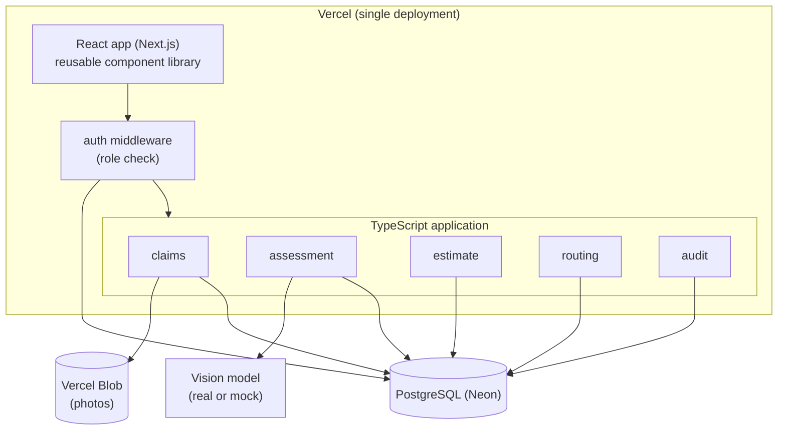
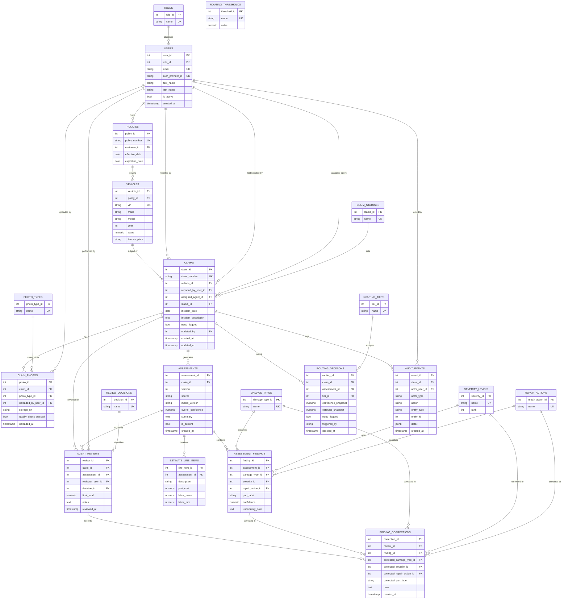

# FastTrack Technical Specification
**Author:** James Hicks · **Date:** June 2026 · **Companion to:** the FastTrack PRD

---

## 1. Purpose

This document describes how FastTrack is built. The PRD covers what the product does and why; this spec covers the architecture, the data model, the module breakdown, the AI contract, and the acceptance criteria the prototype is tested against. It is the document that drives the build and keeps the prototype aligned with the PRD.

## 2. Architecture

FastTrack is a modular monolith: one TypeScript application, deployed as a single unit on Vercel, organized internally into modules along domain boundaries, over one PostgreSQL database. This is the right amount of structure for the current stage. It gives clean separation of concerns without the cost of running and coordinating separate services, and it is built so a module can be pulled out into its own service later if load or team boundaries ever call for it.



**Modules.** The five modules are claims, assessment, estimate, routing, and audit. Each owns a slice of the domain and the tables behind it. Access control is not a module: it is a small auth layer that runs in front of all of them, covered in section 7.

**Built for extraction.** The monolith follows a few rules now so that splitting a module out into its own service later, the move to microservices, is mechanical rather than a rewrite:

- Each module owns its own tables, and only that module reads or writes them. On a single shared database nothing physically stops a cross-table query, so the boundary is held by structure rather than by the database: each module keeps its data access in its own folder and exposes only an interface, and other modules go through that interface rather than reaching into its internals or tables. The convention is simple enough to hold in review now, and a lint rule can enforce it in production. The point is that data ownership is already drawn along service lines, so a future split inherits a clean cut.
- Modules call each other through explicit TypeScript interfaces, with the contracts kept in `shared/`, never by importing another module's internals. Today those calls are in-process function calls; because callers depend on the interface, the same call can become an HTTP or queue call later without the caller changing.
- Audit works the same way: modules hand audit events to the audit module through its interface rather than writing the audit table themselves. In the monolith that handoff is an in-process call; if audit is ever extracted, that interface is where a real message queue would sit.

To extract a module into its own service, you stand it up behind HTTP, give it its own database (its tables already belong only to it), and swap the in-process client for a network client. Nothing in the other modules changes.

**Hosting.** The whole application deploys to Vercel from GitHub as one unit, connected to a Neon-hosted PostgreSQL database. Uploaded photos go to Vercel Blob; the database holds the reference, not the file.

## 3. Tech stack

- **Front end:** React via Next.js (App Router), built from a reusable component library so screens stay consistent and new views are quick to assemble. It calls the backend route handlers using request and response types imported from `shared/`, so there is no hand-written or separately generated client to drift out of sync.
- **Back end:** TypeScript across all modules in one application, so the front end and back end share one set of contract types.
- **Shared contract:** request and response shapes are defined once in `shared/` as Zod schemas. Route handlers validate incoming requests against them at runtime, and both the handlers and the React front end derive their static types from them, so the contract has a single source of truth.
- **Database:** PostgreSQL on Neon, one schema, with each module owning its own tables.
- **File storage:** uploaded photos in Vercel Blob; the database keeps the reference only.
- **Hosting and CI/CD:** the whole application deploys to Vercel from GitHub through one pipeline. There is no separate backend host.

## 4. Repository structure

A monorepo, laid out so the folders mirror the modules. Documentation, including the PRD and this spec, lives in the repo so it stays version-controlled alongside the code.

```
fasttrack/
├── docs/
│   ├── prd.md                  # product requirements
│   ├── technical-spec.md       # this document
│   └── erd.md                  # standalone ERD
├── app/                        # Next.js App Router (deploys to Vercel)
│   ├── components/             # reusable component library
│   ├── (claims)/               # claim intake, review, routing views
│   └── api/                    # route handlers, validated with shared/ schemas
├── modules/                    # backend domain modules (TypeScript)
│   ├── claims/
│   │   ├── interface.ts        # public contract other modules call
│   │   └── internal/           # logic and data access (the only code that touches its tables)
│   ├── assessment/             # vision model integration, produces findings
│   ├── estimate/               # prices findings into line items and totals
│   ├── routing/
│   └── audit/
├── auth/                       # session middleware + role check (owns users, roles)
├── shared/                     # Zod contract schemas and derived types, imported app-wide
└── db/
    ├── schema/                 # Drizzle table definitions, one file per owner
    ├── migrations/             # generated by drizzle-kit
    └── seed/                   # lookup-table and demo seed data
```

Route handlers live under `app/api/` (Next.js convention) and stay thin: they validate input against a `shared/` schema and call into a module's interface. Each folder under `modules/` exposes a public `interface.ts` and keeps its logic and data access private, so that module is the only code that touches its tables. Other modules import only the interface, never the internals or the tables, which is the seam a future service split would replace with a network call. For the prototype this boundary is a convention held in review; a lint rule would enforce it in production. `db/schema/` holds the Drizzle table definitions split one file per module, which makes table ownership explicit in code.

## 5. CI/CD

Deployment is Vercel's GitHub integration: a push to `main` builds and deploys the whole application, with no separate pipeline to maintain. Migrations are generated and applied with a drizzle-kit script run before the deploy, and tests run from a single command.

In production this grows into a fuller pipeline: pull requests run the test suite and an import-boundary lint against a throwaway test database, and migrations are gated behind that check before they touch the live database. For the prototype, Vercel's auto-deploy plus the migration and test scripts are enough, which keeps the build focused on the product rather than the pipeline.

## 6. Modules

Each module owns a slice of the domain and the tables behind it. Other modules use the module's interface, never its tables or internals.

| Module | Owns (tables) | Responsibility |
|---|---|---|
| claims | claims, policies, vehicles, claim_photos, agent_reviews, finding_corrections | Claim lifecycle, photo intake and quality checks, and the agent's review and corrections |
| assessment | assessments, assessment_findings | Calls the vision model and produces the structured findings (damaged parts, damage type, severity, repair action) with per-finding and overall confidence, plus the plain-language summary. Knows nothing about cost |
| estimate | estimate_line_items | Takes the assessment's findings and prices them into line items (parts and labor) and a total; derives possible total loss when the total approaches the vehicle's value |
| routing | routing_decisions, routing_thresholds | Applies confidence, cost, and fraud rules to route each claim; never auto-denies |
| audit | audit_events | Append-only record of every AI output and human action. The other modules hand it events through its interface; it is the only writer of the audit table |

Access control is not a module. The `users` and `roles` tables and the role check belong to a small auth layer that runs in front of every module, described in section 7.

Estimate is its own module that depends on the assessment's findings and prices them. The dependency runs one way: estimate reads assessment's output through its interface, and assessment knows nothing about estimate. So the flow is claims, then assessment, then estimate, then routing, which lets assessment be extracted on its own without dragging pricing along, and lets pricing grow its own logic (rate tables, external cost databases) without touching the vision code.

## 7. Users and roles

Agents, supervisors, and customers are all real users in the system, distinguished by role. Roles live in a lookup table. Access control is a cross-cutting concern rather than a module: a small auth layer (middleware plus a helper the route handlers call) checks the user's role on every request, in front of the domain modules, and it owns the `users` and `roles` tables.

| Role | Maps to (PRD) | Can do |
|---|---|---|
| `customer` | Policyholder | Submit a claim and photos upstream, view their own claim status, request a human review |
| `agent` | Claims agent | Open assigned claims, review and override assessments, set the final estimate |
| `supervisor` | Senior adjuster | Everything an agent can do, plus approve escalated and high-value claims, set routing thresholds |

A user has exactly one role, which the `supervisor` can change. Access is least-privilege: a customer can only see their own claims, an agent sees their assigned queue, a supervisor sees the team's. In production the supervisor also owns the routing thresholds (the confidence and cost cutoffs in `routing_thresholds`). In the prototype those are seeded constants rather than an editable screen, since the supervisor settings dashboard is out of scope.

For the prototype, the three role accounts are pre-seeded and selectable, so the build time goes into the assessment loop rather than a sign-up flow. The auth layer maps the selected user to a role and enforces it. In production, authentication is delegated to an auth provider (for example Auth.js or Clerk) rather than hand-built, and the same auth layer maps the authenticated user to a role. That keeps the role model intact without taking on the security surface of a custom auth system.

## 8. Data model and ERD

The schema is normalized to third normal form. Repeated categorical values (roles, statuses, damage types, and so on) live in lookup tables rather than being copied as strings, so there is a single source of truth for each value. Every relationship is enforced by a foreign key. Nothing derivable is stored twice, apart from a small set of deliberate point-in-time records noted below.

`policies` and `vehicles` are modeled the way a real insurer would need them, but the prototype only seeds them and does not run any policy or coverage logic, which sits outside FastTrack's scope. They are in the schema so the claim, vehicle, and policyholder relationships are correct, not because the prototype exercises them. `vehicles.value` is seeded and is the figure the estimate module compares the repair total against for total loss. `claims.fraud_flagged` is a settable signal that routing reads; real fraud detection is a P2 item, so in the prototype the flag is set in seed data to exercise the fraud-to-supervisor path.



### Lookup tables

`roles`, `claim_statuses`, `photo_types`, `damage_types`, `severity_levels`, `repair_actions`, `routing_tiers`, and `review_decisions` are all small reference tables. They keep categorical values in one place, so a status, a damage type, or an agent's decision (approve, deny, escalate) is stored as a foreign key, never as a free-text string that could drift or be misspelled across rows.

A few categorical-looking columns are deliberately left as plain strings, for the same reason the indexing stays minimal: a lookup table earns its place only when the value is shared domain vocabulary that is read back, joined, or reused across rows. `assessments.source` (real or mock) and `routing_decisions.triggered_by` are tiny fixed technical flags that nothing joins on, so a table for them would be overhead without payoff. The `audit_events` columns (`actor_type`, `action`, `entity_type`) are kept denormalized on purpose: an append-only log should stay self-contained and readable on its own, so it must not depend on lookup rows that could change or disappear after the event was recorded. Those are choices, not omissions.

`routing_thresholds` is config rather than a lookup: the routing module reads its named values (the confidence and cost cutoffs) directly, so nothing foreign-keys to it, which is why it stands on its own in the diagram.

### Indexing

The aim is to index what queries actually use, and nothing more.

- **Primary keys** are indexed automatically.
- **Unique indexes** back the natural keys: `users.email`, `users.auth_provider_id`, `policies.policy_number`, `vehicles.vin`, `claims.claim_number`.
- **Foreign keys that are filtered or joined** get an index: for example `assessments.claim_id` (loading a claim's assessment is the most common read), `claim_photos.claim_id`, `assessment_findings.assessment_id`, `routing_decisions.claim_id`, `audit_events.claim_id`.
- **One composite index** supports the most common operational query, an agent pulling their open work: `claims (assigned_agent_id, status_id)`.
- **What is deliberately not indexed:** foreign keys into the small lookup tables, where the planner will pick a scan anyway, and any column not used in a filter, join, or sort. No two indexes cover the same leading columns.

### Redundancy

Nothing derivable is duplicated. Customer names live only in `users` and are reached by foreign key, never copied onto claims. Line-item and claim totals are computed from `estimate_line_items` rather than stored. The exceptions are a few point-in-time records that look like copies but are not: each captures what something was at the moment a decision was made, so it is deliberately frozen rather than recomputed. These are `assessments.overall_confidence` (what the model produced), `agent_reviews.final_total` (what the human decided), and `routing_decisions.confidence_snapshot`, `routing_decisions.estimate_snapshot`, and `routing_decisions.fraud_flagged` (the confidence, estimate, and fraud signal the routing decision was actually based on, which must not change even if a later re-assessment does). Possible total loss is not one of these; it is derived, not stored, with the estimate module computing it by comparing the estimate total to the vehicle's value, so there is no flag to keep in sync.

`agent_reviews` and `routing_decisions` each carry `claim_id` even though it is reachable through their `assessment_id`. That is deliberate, not duplication: the claim is the aggregate these records belong to, so they reference it directly as their parent link and as the key they are queried and indexed by, and it stays stable across assessment versions. That is different from a value reachable through a sibling, like the policy behind a claim's vehicle, which is why a claim does not store its own `policy_id`.

Agent corrections are stored as a snapshot. When an agent changes a finding, `finding_corrections` records the corrected values for that finding next to the original in `assessment_findings`, so the before-and-after pair is preserved without a row per changed field. Agents can override the AI-detected damage type (`corrected_damage_type_id`), severity (`corrected_severity_id`), repair action (`corrected_repair_action_id`), and part label (`corrected_part_label`). The per-field delta can be computed from that pair when needed. Production would capture field-level deltas directly to feed model retraining; the prototype keeps the lighter snapshot and defers that.

Photo files are not stored in the database. `claim_photos.storage_url` holds a reference to the file in Vercel Blob, which keeps large binaries out of Postgres and lets the database stay lean.

### Row history

Timestamp and actor columns are applied by table type, not by default. Lookup tables, which are seeded reference data, carry none. The append-only records each carry one creation timestamp named for the event (`assessments.created_at`, `agent_reviews.reviewed_at`, `finding_corrections.created_at`, `routing_decisions.decided_at`, `claim_photos.uploaded_at`, `audit_events.created_at`), and their human author is a foreign key where one applies. Findings and line items have no timestamp of their own: they are written in the same step as their parent assessment and share its time. None of these records are ever edited, so none carry `updated_*` columns, since a change is a new row rather than an edit. `claims` is the one record that genuinely mutates over its life as its status moves, so it also carries `updated_at` and `updated_by`. The full who-did-what-when history lives in `audit_events`, so stamping every table with created-by and updated-by columns would just duplicate the log built for exactly that.

## 9. AI integration

The assessment module takes a claim's photos and returns a structured assessment. The same response contract is used whether the call hits a real vision model or a mock, so the rest of the system never changes between them.

A vision call can take several seconds, and a Vercel function has a limited execution window, so a synchronous call works for the prototype but not for production volume. The production answer is a queued job: the request enqueues the work and returns, a worker runs the assessment, and the UI polls or streams the result. That worker and queue are real infrastructure a monolith on Vercel does not have on its own (they would come from a queue service such as Inngest or QStash, or a dedicated worker), so this is one of the first concrete reasons to extract assessment into its own service. The prototype runs the assessment synchronously behind the assessment interface, so the later move to a queued job changes only what sits behind that interface, not the callers.

The pipeline runs in stages, each emitting its own confidence: image validation (usable, complete, not edited), detection and classification of damaged parts, mapping each part to the repair it needs, and a written summary with a recommended next step. Pricing is not part of this step; the estimate module prices the findings afterward. If any stage is not confident, the claim goes to a person rather than being acted on automatically.

**Confidence** is a calibrated composite, not a single raw model score. It blends the model's prediction probability with image quality and coverage, an out-of-distribution check for unusual vehicles or damage, and the hidden-damage risk of the damage pattern. Findings roll up weakest-link rather than averaged, so one uncertain critical part lowers the whole claim's confidence. Scores are calibrated against labeled historical claims so that a stated 90% means roughly 90% correct. (Industry photo-estimation reaches roughly 90 to 95% accuracy on clear damage and degrades on minor, hidden, or structural damage, which is why low confidence routes to a human.)

### Response contract

The assessment response carries the findings and confidence only. Pricing and the routing tier are not in it: the estimate module turns these findings into line items, a total, and the derived total-loss flag, and the routing module uses the overall confidence and that total to assign a tier.

```json
{
  "claim_id": "string",
  "source": "real | mock",
  "model_version": "string",
  "overall_confidence": 0.0,
  "summary": "string",
  "findings": [
    {
      "part_label": "string",
      "damage_type": "scratch | dent | structural | glass",
      "severity": "minor | moderate | severe",
      "repair_action": "repair | replace",
      "confidence": 0.0,
      "uncertainty_note": "string | null"
    }
  ]
}
```

## 10. Routing logic

The routing module reads confidence, estimate size, and any fraud flag, then assigns a tier:

- **High confidence, low cost, no fraud flag → `auto_approved`**, with a sample held back for an agent to spot-check.
- **Low confidence → `confidence_below_threshold`**, routed to an agent for review. The agent may approve, deny, or escalate to a senior adjuster.
- **Everything else → `agent_review`**, with the assessment as an editable draft. The agent may approve, deny, or escalate to a senior adjuster.
- **High-value claims, fraud-flagged claims, or possible total loss → `senior_adjuster`**, always, regardless of confidence. "High-value" is a cost threshold held in `routing_thresholds`; in production a supervisor sets it, and in the prototype it is seeded. Claims already at this tier cannot be escalated further.

The `triggered_by` field on `routing_decisions` records the specific signal that determined the tier: `fraud_flag`, `possible_total_loss`, `estimate_exceeds_threshold`, `confidence_below_threshold`, or `confidence_and_cost_within_threshold`.

**No claim is ever auto-denied.** The system can flag a claim for investigation (low confidence, fraud signal, damage that does not match the report) and route it to a person, but a denial is always a human decision, recorded as an `agent_review` outcome. A wrong auto-approval is a bounded cost; a wrong auto-denial harms a customer and carries regulatory risk, so the two are not automated symmetrically. Denials also turn on coverage and liability, which this product does not assess.

## 11. Acceptance criteria

Each P0 feature is done when its criteria pass against the running prototype.

- **Intake.** Given an agent opens a claim and uploads photos, the system checks that a minimum set is present (a fixed count and the required types) and marks the claim ready for assessment; if any are missing it prompts for the rest. Deeper coverage and image-quality analysis is stubbed in the prototype.
- **AI assessment.** Given a claim with valid photos, running the assessment returns per-finding and overall results (part, damage type, severity) and a plain summary, persisted against the claim.
- **Estimate.** Given findings, the system produces an itemized estimate (parts and labor) with a total, and derives possible total loss when the cost approaches the vehicle's value.
- **Confidence and triage.** Given an assessment, every finding and the claim carry a confidence value and any uncertainty notes, and routing combines that confidence with the estimate total into a recommended tier shown to the agent. Auto-approval acts on that tier only once enabled at P1.
- **Review and override.** Given an assessment, when the agent accepts, edits, or overrides a finding (damage type, severity, repair action, or part label), the change persists, the agent's final estimate is stored as authoritative, and the corrected finding is written to `finding_corrections` as a snapshot alongside the original. When the decision is Deny, the final total field is hidden and a zero total is recorded.
- **Routing and auto-approval (P1).** Given thresholds, a high-confidence, low-cost, fraud-clean claim auto-approves; a low-confidence claim routes to an agent as `confidence_below_threshold`; everything else routes to an agent as `agent_review`; high-value, fraud-flagged, or possible total-loss claims always route to a senior adjuster; no claim is auto-denied.
- **Audit (P1).** Given any AI output or human action, an `audit_events` row is written with actor, action, entity, and timestamp.

## 12. Traceability

| PRD story / feature | Module | Key tables | Acceptance criterion | Prototype |
|---|---|---|---|---|
| Photos to damage summary | assessment | assessments, assessment_findings | AI assessment | Built |
| Line-item estimate | estimate | estimate_line_items | Estimate | Built |
| Confidence and flags, focus and routing | assessment, routing | assessments, routing_decisions | Confidence and triage | Built |
| Accept / edit / override, capture correction | claims | agent_reviews, finding_corrections | Review and override | Built |
| Escalation arrives with assessment and notes | routing, claims | routing_decisions, agent_reviews | Routing and auto-approval | Built (handoff) |
| Audit trail of AI and agent actions | audit | audit_events | Audit | Built |
| Auto-approval | routing | routing_decisions, routing_thresholds | Routing and auto-approval | Shown, gated |
| Fraud, video, vehicle-data, shop-quote, retraining | n/a | n/a | n/a | Described, not built |

## 13. Build decisions (prototype)

These are the implementation choices the build follows, so the prototype comes out matching the spec rather than improvising. Each is the prototype default; the production path is noted where it differs.

- **Stack.** Next.js (App Router) and TypeScript on Vercel. Data access and migrations use Drizzle and drizzle-kit, with each module's tables in their own schema file so ownership is explicit in code. UI uses Tailwind and shadcn/ui; the front end fetches and polls with TanStack Query.
- **Auth.** The three role accounts are seeded and chosen with a role switcher backed by a mock session, no real credentials. Auth.js with a real provider is the production path; the auth layer's role mapping is the same either way.
- **Identifiers.** Claim-facing records (claims, assessments) use UUIDs so URLs are not trivially enumerable, which supports the rule that a customer sees only their own claims. Lookup tables keep small integer keys.
- **Money.** Stored as Postgres `numeric` (exact decimal), never floating point. Possible total loss is flagged when the repair total reaches 75% or more of `vehicles.value`.
- **Photos.** The prototype uploads photos to Vercel Blob and stores the returned URL in `claim_photos.storage_url`; the seed script uploads the demo images for the seeded claims the same way. The demo images are a few committed sample car photos; because the mock keys off the seed claim rather than the image content, the photos only need to look plausible. The image-quality check stays a stub (a fixed pass or fail per photo); a real quality heuristic is the production path.
- **Mock vision and seed scenarios.** The assessment's mock returns deterministic fixtures tied to named seed claims, one per routing branch: a clean high-confidence low-cost claim that auto-approves, an ambiguous claim that routes to an agent, a severe near-total-loss claim that routes to a supervisor, and a fraud-flagged claim that routes to a supervisor. Auto-approval is off by default, so a person reviews every claim; the demo enables it for the clean scenario so the auto-approve branch can be seen end to end. A claim created live during the demo gets one default plausible mock assessment, so creating a claim is never a dead end; the four seeded claims are what showcase the distinct branches.
- **Vision model path.** The built and default path is the mock. The real path calls a vision model (Claude's image API) behind the same response contract and the mock-vision toggle; it is structurally supported but optional, and the prototype is complete on the mock alone. Demo whichever is stable.
- **Estimate pricing.** The estimate module prices each finding in code: a line item is `part_cost + labor_hours * labor_rate`, with a fixed shop labor rate (for example $60 per hour) and base part cost and hours keyed to severity and repair-versus-replace (minor-and-repair small, severe-and-replace large). A real parts-and-labor rate table is the production path. The seed claims' findings are tuned so their totals land in the intended routing bands: under $2,500 for the clean auto-approve claim, $10,000 or more for the high-value supervisor claim.
- **Default thresholds.** `routing_thresholds` are seeded so those claims land where intended: auto-approve when overall confidence is at least 0.90 and the estimate is at most $2,500; supervisor when the estimate is high-value ($10,000 or more) or total loss or fraud-flagged; agent review otherwise.
- **Assessment versioning.** The prototype creates one current assessment per claim. `version` and `is_current` exist so a re-assessment can be added later (new version, flip `is_current`) without a schema change, but the re-run flow is not built.
- **Endpoint surface.** Each route is validated by a Zod schema in `shared/`: `POST /api/claims` (create with photos), `POST /api/claims/:id/assess` (runs assessment, estimate, and routing), `GET /api/claims/:id` (full claim view), `POST /api/claims/:id/review` (agent decision, corrections, final estimate), `GET /api/claims` (role-scoped queue), `GET /api/vehicles` (vehicles for the current user or all vehicles for agents), `GET /api/users` (user list for the agent customer-picker), and `POST /api/upload` (generates a short-lived Vercel Blob client token for direct browser-to-Blob photo uploads).
- **Config.** A `.env.example` lists the Neon database URL, the Vercel Blob read/write token (`BLOB_READ_WRITE_TOKEN`), the vision model key, a mock-vision toggle, and the auth secret. `BLOB_READ_WRITE_TOKEN` must also be set in the Vercel project environment variables; the upload handler returns a 503 if it is absent.
- **Tests.** Unit tests cover the routing rules and the estimate math, run from a single command. Enough to show rigor without expanding the build.
- **Mocked or deferred.** The vision model is mocked, confidence is a transparent heuristic rather than a calibrated model, and the assessment runs synchronously (no queue). Deployment is Vercel's GitHub integration with migrations applied by a drizzle-kit script; the import-boundary lint and a fuller CI pipeline are production additions. Each has its production form described in the relevant section.

### Screens

The prototype ships these views, built from the shared component library:

- **Queue.** The role-scoped list of claims (an agent sees their assigned queue, a supervisor the team's, a customer their own). Each row shows claim number, status, routing tier, AI estimate, and (for approved claims) the agent-set approved total. Columns are sortable; the list is filterable by status and routing tier with a free-text search across claim number, vehicle, and customer. Agents and supervisors see a Customer column showing the vehicle's policy holder, regardless of who filed the claim.
- **Claim detail and review.** For a claim that is `ready_for_assessment`, the agent runs the assessment from here (a button that calls `/assess`, with a loading state while it runs synchronously). Once assessed and routed, the view shows the photos, the AI findings (part, damage type, severity, repair action, per-finding confidence, any uncertainty note), the overall confidence, the line-item estimate and total, and the possible-total-loss flag. The agent can accept, edit, or override each finding inline — damage type, severity, repair action, and part label are all editable through dropdowns and a text field, which writes `finding_corrections`. The review form shows the routing tier and its trigger reason in human-readable form. The agent sets the final estimate and chooses a decision: Approve, Deny, or (for `agent_review` and `confidence_below_threshold` tier claims not yet escalated) Escalate to a senior adjuster. The final total field is hidden when the decision is Deny. A claim whose assessment failed shows as needing review rather than as an error.
- **Intake.** Create a claim by selecting an existing customer and then one of that customer's vehicles (agents pick from all customers; customers see only their own vehicles). Vehicle selection pre-fills make, model, year, VIN, plate, and the value the total-loss check later uses. Requires at least four photos (front, rear, left side, right side) uploaded to Vercel Blob before submission. This is a lightweight picker over seeded data, not a customer or vehicle management screen.
- **Role switcher.** A simple control to switch between the seeded customer, agent, and supervisor accounts, standing in for login. The customer view is read-only status plus a request-human-review action.

Confidence is shown as both the number and a simple visual cue (for example a colored band) so low-confidence findings are obvious at a glance.

### Seed data

Claim statuses and their legal transitions. Routing runs before any human review, so a claim is triaged (`routed`) before it reaches a person, and an auto-approved claim skips review:

- `draft` to `ready_for_assessment`
- `ready_for_assessment` to `assessed`
- `assessed` to `routed`
- `routed` to `approved` (auto-approval) or `in_review`
- `in_review` to `approved`, `denied`, or `escalated`
- `escalated` to `approved` or `denied`
- `approved` and `denied` to `closed`

Lookup values:

- `roles`: customer, agent, supervisor
- `claim_statuses`: the nine above
- `photo_types`: front, rear, left, right, vin_plate, odometer, detail
- `damage_types`: scratch, dent, structural, glass
- `severity_levels`: minor (1), moderate (2), severe (3)
- `repair_actions`: repair, replace
- `routing_tiers`: auto_approved, agent_review, confidence_below_threshold, senior_adjuster
- `review_decisions`: approved, denied, escalated

## 14. Non-functional requirements

- **Security.** Authentication is delegated to an auth provider, so the application stores no passwords. Every request carries the authenticated user, role-based access is checked on each one, all traffic is over HTTPS, and data access is least-privilege per role.
- **Privacy.** Photos can contain personal information and location data; they are stored with defined retention limits and access is restricted to the handling agent and supervisor.
- **Auditability.** The audit log is append-only; entries are never edited or deleted, so any claim's history can be reconstructed.
- **Reliability.** If the vision model is slow or unavailable, the claim degrades to human review rather than failing, so the workflow never blocks on the AI.
- **Performance.** The assessment should return quickly enough to feel interactive to the agent; the specific target is set against the manual baseline once measured.
- **Data integrity.** Foreign keys and transactions guarantee that a claim, its assessment, findings, and estimate are always consistent with one another.

## 15. Out of scope

Customer-facing self-service assessment, the supervisor and operations dashboards beyond the escalation handoff, and all P2 items (fraud detection, video and multi-angle capture, vehicle-data cross-check, shop-quote reconciliation, model retraining) are documented in the PRD but not built in this version.
